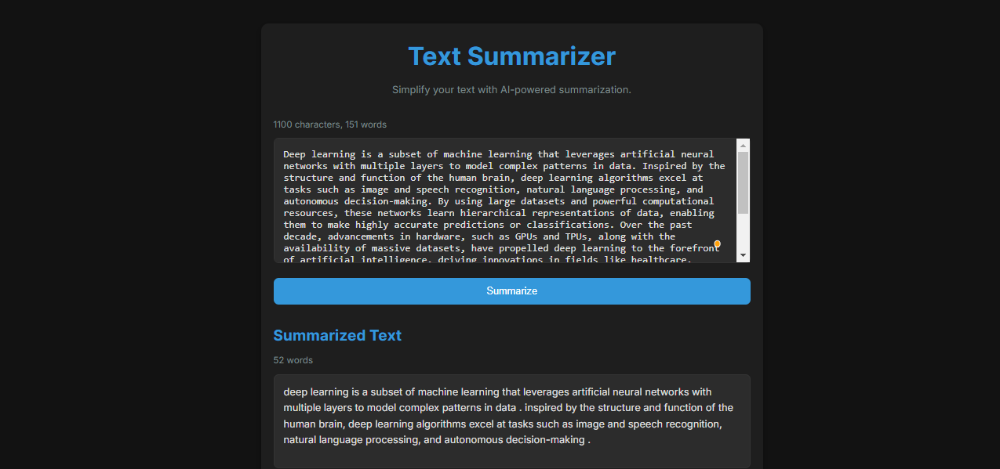
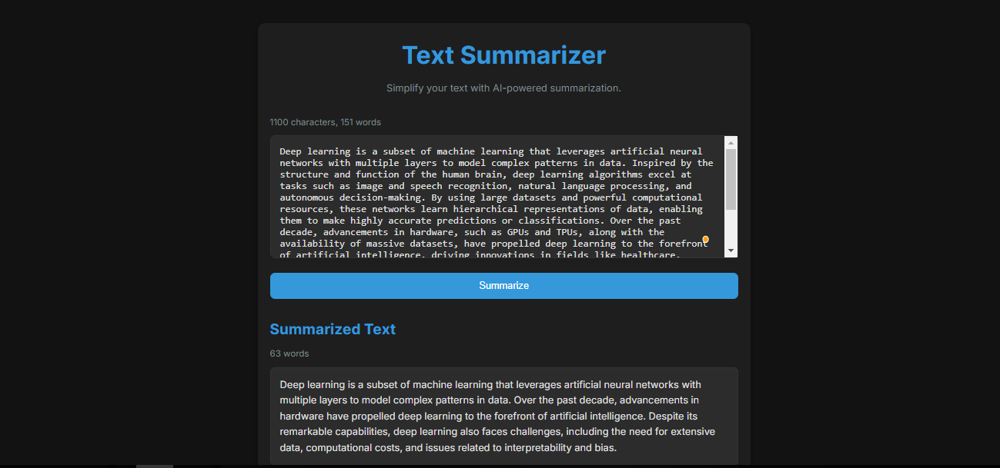

# Text Summarization Projects

This repository contains two text summarization projects built using natural language processing (NLP) models. The projects are implemented using Flask for the backend and HTML/CSS/JavaScript for the frontend.

---

## Projects Overview

### 1. **Ensemble Summarization**
This project uses an ensemble of two pre-trained models, **BART** and **GPT-2**, to generate summaries of input text. The ensemble method combines the outputs of both models and selects the most frequent summary as the final result.

- **Models Used**:
  - **BART (Bidirectional and Auto-Regressive Transformers)**: A transformer-based model fine-tuned for summarization tasks.
  - **GPT-2 (Generative Pre-trained Transformer 2)**: A transformer-based model capable of generating coherent and contextually relevant text.

- **Features**:
  - Input text is summarized using both models.
  - The final summary is selected based on the most frequent output.
  - Interactive web interface for input and output.

---

### 2. **T5 Summarization**
This project uses the **T5 (Text-To-Text Transfer Transformer)** model for text summarization. T5 is a versatile transformer model that treats all NLP tasks as a text-to-text problem, making it highly effective for summarization.

- **Model Used**:
  - **T5 (Text-To-Text Transfer Transformer)**: A transformer-based model fine-tuned for summarization tasks.

- **Features**:
  - Input text is summarized using the T5 model.
  - Interactive web interface for input and output.

---

## Technologies Used

- **Backend**:
  - Python
  - Flask (Web framework)
  - Hugging Face Transformers (for pre-trained models)
  - PyTorch (for model inference)

- **Frontend**:
  - HTML
  - CSS
  - JavaScript

- **Pre-trained Models**:
  - BART (`facebook/bart-large-cnn`)
  - GPT-2 (`gpt2`)
  - T5 (`t5-base`)

---

## Application Interface

**T5 Summarization**

 

**Ensemble Summarization**

